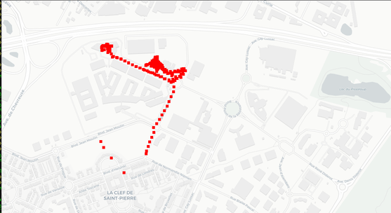
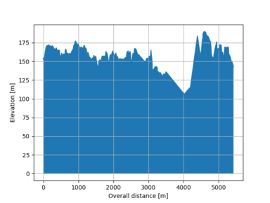

## Mini GPS data logger 

The idea behind this project is to have a 
long lasting GPS data logger.

The selected module is the PMTK3339 GPS receiver
provided by Adafruits on a breakout board.

An MSP430 is used to kick start the GPS module,
this device has extensive options to reduce power
consumption.

### What you can learn from this project

* How to compile code for MSP430 devices
* Use MSP430 features to reduce power consumption
* Manipulate coordinates
	* D° M' S"
	* Decimal degrees
	* etc.. 
* Discover NMEA data 

### Examples

Test 1: first try




### Getting started

Required packages:

```bash
# apt-get install binutils-msp430 gcc-msp430 msp430-libc mspdebug
```

compile the program with

```bash
make
```

### Use mspdebug to flag the program

```bash
# mspdebug rf2500
# erase
# load main.elf
# run
```

### Python tool

A python tool to control the PMKT module over
serial port and manipulate .nmea data.

```bash
python3 python/tools.py --help
```

The script can send known commands to the module
over serial port.

```bash
python3 python/tools.py /dev/ttyUSB0 --status
python3 python/tools.py /dev/ttyUSB0 --start-logging
```

The script can convert .nmea files to .kml & .gpx
files (kml: Google earth.., gpx: OpenStreetMap, GPSVisualizer..).

```bash
python3 python/tools.py --nmea-to-kml
python3 python/tools.py --nmea-to-gpx
python3 python/tools.py --nmea-to-kml --file=raw.nmea
```

The script allows to view data waypoints contained
in a .nmea, a .kml or a .gpx file over a map, using
"geoplotlib":

```bash
python3 python/tools.py --view-coordinates
python3 python/tools.py --view-coordinates --file=raw.nmea
python3 python/tools.py --view-coordinates --file=raw.kml
```

Elevation profile can optionnally be drawn:

```bash
python3 python/tools.py --view-coordinates --file=raw.nmea --elevation-profile
```

Required python packages to run the script:

1. python >= 3
2. pyserial
3. geoplotlib <https://github.com/andrea-cuttone/geoplotlib>
4. matplotlib
